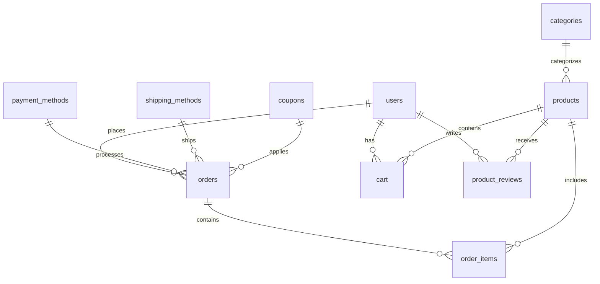

# MS Glow Store - E-Commerce Platform

📽️ **Demo Aplikasi (YouTube):**  
[👉 Klik untuk menonton demo aplikasi](https://youtu.be/9v8mYAi-pPo?si=UlfuVZ7aMff3WbSh)

<div align="center">
  
  
  [](https://php.net)
  [](https://mysql.com)
  [](https://apache.org)
  [](https://getbootstrap.com)
  [](LICENSE)
</div>

---

## 📋 Table of Contents

- [Overview](#overview)
- [Demo Login](#demo-login)
- [Features](#features)
- [Technology Stack](#technology-stack)
- [Installation](#installation)
- [Usage](#usage)
- [Project Structure](#project-structure)
- [Database Schema](#database-schema)
- [API Documentation](#api-documentation)
- [Contributing](#contributing)
- [License](#license)
- [Support](#support)

---

## 🎯 Overview

**MS Glow Store** adalah platform e-commerce yang dikembangkan khusus untuk menjual produk kecantikan MS Glow. Aplikasi ini menyediakan pengalaman berbelanja online yang lengkap dengan fitur manajemen produk, sistem checkout yang user-friendly, dan panel admin yang komprehensif.

### Key Highlights
- 🛍️ **Modern E-commerce Experience** - Interface yang intuitive dan responsive
- 🔐 **Secure Authentication** - Sistem login yang aman dengan role-based access
- 📦 **Complete Order Management** - Dari checkout hingga delivery tracking
- 💳 **Multiple Payment Options** - COD, Transfer Bank, dan E-Wallet
- 📊 **Admin Dashboard** - Komprehensif untuk manajemen bisnis
- 🎨 **Responsive Design** - Optimized untuk desktop dan mobile
- 📱 **Mobile Friendly** - Fully responsive untuk semua device

---

## 🔑 Demo Login

Untuk testing aplikasi, gunakan akun demo berikut:

### 👨‍💼 Admin Account
```
Email: admin@msglow.com
Password: admin123
```
**Akses:** Dashboard admin, manajemen produk, pesanan, user, dan laporan

### 👤 User Account
```
Email: user@msglow.com
Password: user123
```
**Akses:** Shopping, checkout, riwayat pesanan, dan profil user

> **Note:** Pastikan data demo sudah diimport ke database menggunakan file `msglow_store_database.sql`

---

## ✨ Features

### For Customers
- [x] **User Registration & Authentication** - Daftar dan login yang aman
- [x] **Product Catalog** - Browse produk dengan search dan filter
- [x] **Shopping Cart Management** - Kelola keranjang belanja
- [x] **Multi-step Checkout Process** - Proses checkout yang mudah
- [x] **Multiple Shipping Options** - Pilihan pengiriman (Reguler, Express, Instant)
- [x] **Multiple Payment Methods** - COD, Transfer Bank, E-Wallet
- [x] **Order History & Tracking** - Riwayat dan tracking pesanan
- [x] **User Profile Management** - Kelola profil dan alamat
- [x] **Product Reviews** - Review dan rating produk
- [x] **Responsive Design** - Optimized untuk mobile dan desktop

### For Administrators
- [x] **Comprehensive Admin Dashboard** - Dashboard lengkap dengan statistik
- [x] **Product Management** - CRUD operations untuk produk
- [x] **Category Management** - Kelola kategori produk
- [x] **Order Processing** - Update status pesanan dan fulfillment
- [x] **Payment Method Configuration** - Kelola metode pembayaran
- [x] **Shipping Method Management** - Kelola opsi pengiriman
- [x] **User Management** - Kelola user dan admin
- [x] **Sales Analytics & Reports** - Laporan penjualan dan PDF export
- [x] **Coupon Management** - Kelola kupon dan diskon
- [x] **Product Reviews Moderation** - Moderasi review produk

### Technical Features
- [x] **Session-based Authentication** - Keamanan berbasis session
- [x] **SQL Injection Protection** - Prepared statements dan sanitization
- [x] **File Upload Validation** - Validasi upload gambar yang aman
- [x] **Image Optimization** - Optimasi gambar produk
- [x] **Database Relationship Integrity** - Foreign key constraints
- [x] **Error Handling & Logging** - Penanganan error yang baik
- [x] **AJAX Integration** - Real-time updates tanpa refresh
- [x] **PDF Report Generation** - Export laporan ke PDF

---

## 🛠️ Technology Stack

### Backend
- **Language**: PHP 7.4+
- **Database**: MySQL 8.0+
- **Web Server**: Apache 2.4+
- **Architecture**: MVC Pattern
- **Session Management**: PHP Sessions

### Frontend
- **Framework**: Bootstrap 5.0+
- **JavaScript**: Vanilla JS + jQuery 3.6+
- **CSS**: Custom CSS + Bootstrap
- **Icons**: Font Awesome 6.4+
- **Charts**: Chart.js (untuk dashboard)

### Development Tools
- **Version Control**: Git
- **Development Environment**: XAMPP/MAMP
- **Database Management**: phpMyAdmin
- **Code Editor**: VS Code (recommended)
- **Package Manager**: Composer (optional)

---

## 🚀 Installation

### Prerequisites
Pastikan sistem Anda memiliki:
- PHP 7.4 atau lebih baru
- MySQL 5.7 atau lebih baru
- Apache Web Server
- Git (opsional)

### Quick Start
1. **Clone repository**
   ```bash
   git clone https://github.com/your-username/MSglowstore.git
   cd MSglowstore
   ```

2. **Setup database**
   ```sql
   CREATE DATABASE msglow_store;
   ```

3. **Import database structure**
   ```bash
   mysql -u root -p msglow_store < msglow_store_database.sql
   ```

4. **Configure database connection**
   ```php
   // Edit config/database.php
   $host = "localhost";
   $username = "root";
   $password = "";
   $database = "msglow_store";
   ```

5. **Set file permissions**
   ```bash
   chmod -R 755 uploads/
   ```

6. **Access application**
   ```
   http://localhost/MSglowstore/
   ```

📚 **Detailed Installation Guide**: [docs/INSTALLATION.md](docs/INSTALLATION.md)

---

## 💡 Usage

### Customer Workflow
1. **Browse Products** → Browse catalog atau search products
2. **Add to Cart** → Select products and add to shopping cart
3. **Checkout** → Complete order with shipping and payment details
4. **Order Confirmation** → Receive order confirmation
5. **Track Order** → Monitor order status and delivery

### Admin Workflow
1. **Login to Admin Panel** → Access admin dashboard
2. **Manage Products** → Add, edit, or remove products
3. **Process Orders** → Update order status and manage fulfillment
4. **Monitor Analytics** → View sales reports and statistics
5. **Generate Reports** → Export sales reports to PDF

📖 **Complete User Guide**: [docs/USAGE.md](docs/USAGE.md)

---

## 📁 Project Structure

```
MSglowstore/
├── docs/                      # Documentation
│   ├── DATABASE.md           # Database schema and setup
│   ├── DEPLOYMENT.md         # Deployment guide
│   ├── INSTALLATION.md       # Installation instructions
│   ├── USAGE.md             # User guide
│   ├── README_orders.md     # Order system documentation
│   └── erd_diagram.png      # Entity relationship diagram
├── admin/                    # Admin panel
│   ├── orders.php           # Order management
│   ├── users.php            # User management
│   ├── sales_report.php     # Sales reports
│   ├── sales_report_pdf.php # PDF export
│   ├── order_detail.php     # Order details
│   └── reset_admin_password.php # Password reset
├── categories/               # Category management
│   ├── index.php            # Category list
│   ├── create.php           # Add category
│   ├── edit.php             # Edit category
│   └── delete.php           # Delete category
├── config/                   # Configuration files
│   └── database.php         # Database connection
├── orders/                   # Order management
│   ├── index.php            # Order history
│   ├── checkout.php         # Checkout process
│   ├── checkout_simple.php  # Simple checkout
│   ├── confirmation.php     # Order confirmation
│   ├── thank_you.php        # Thank you page
│   ├── debug.php            # Debug tools
│   └── README.md            # Order system docs
├── payment_methods/          # Payment method management
│   ├── index.php            # Payment method list
│   ├── create.php           # Add payment method
│   ├── edit.php             # Edit payment method
│   └── delete.php           # Delete payment method
├── products/                 # Product management
│   ├── index.php            # Product list
│   ├── create.php           # Add product
│   ├── edit.php             # Edit product
│   └── delete.php           # Delete product
├── uploads/                  # File uploads
│   ├── products/            # Product images
│   ├── banners/             # Banner images
│   └── ambassadors/         # Ambassador images
├── index.php                # Homepage
├── login.php                # Login page
├── register.php             # Registration page
├── logout.php               # Logout handler
├── dashboard.php            # User dashboard
├── pemesanan.php            # Order page
├── proses_pemesanan.php     # Order processing
└── msglow_store_database.sql # Database structure
```

---

## 🗄️ Database Schema

### Core Tables
- **users** - User accounts and authentication
- **products** - Product catalog and inventory
- **categories** - Product categorization
- **orders** - Order management
- **order_items** - Order line items
- **payment_methods** - Payment options
- **shipping_methods** - Shipping options
- **product_reviews** - Product reviews and ratings
- **coupons** - Discount coupons
- **cart** - Shopping cart items

### Entity Relationships


📊 **Database Documentation**: [docs/DATABASE.md](docs/DATABASE.md)

---

## 🔧 API Endpoints

### Public Endpoints
- `GET /` - Homepage
- `GET /products/` - Product catalog
- `POST /login.php` - User login
- `POST /register.php` - User registration

### User Endpoints (Authenticated)
- `GET /dashboard.php` - User dashboard
- `GET /orders/` - Order history
- `POST /orders/checkout.php` - Checkout process
- `GET /orders/confirmation.php` - Order confirmation

### Admin Endpoints (Admin Only)
- `GET /admin/orders.php` - Order management
- `GET /admin/users.php` - User management
- `GET /admin/sales_report.php` - Sales reports
- `GET /admin/sales_report_pdf.php` - PDF export

---

## 🚢 Deployment

### Production Deployment
1. **Server Setup** - Configure web server and database
2. **Environment Configuration** - Set production settings
3. **Database Migration** - Deploy schema and data
4. **Security Hardening** - Implement security best practices
5. **Performance Optimization** - Configure caching and optimization

🔧 **Deployment Guide**: [docs/DEPLOYMENT.md](docs/DEPLOYMENT.md)

---

## 🤝 Contributing

1. Fork the repository
2. Create your feature branch (`git checkout -b feature/AmazingFeature`)
3. Commit your changes (`git commit -m 'Add some AmazingFeature'`)
4. Push to the branch (`git push origin feature/AmazingFeature`)
5. Open a Pull Request

---

## 📄 License

This project is licensed under the MIT License - see the [LICENSE](LICENSE) file for details.

---

## 🆘 Support

Jika Anda mengalami masalah atau memiliki pertanyaan:

- 📧 **Email**: support@msglow.com
- 📱 **WhatsApp**: +62 812-3456-7890
- 🐛 **Issues**: [GitHub Issues](https://github.com/your-repo/issues)
- 📖 **Documentation**: [docs/](docs/)

---

## 🎉 Acknowledgments

- MS Glow untuk brand dan produk
- Bootstrap untuk UI framework
- Font Awesome untuk icons
- jQuery untuk JavaScript functionality
- Chart.js untuk dashboard analytics

---

<div align="center">
  <p>Made with ❤️ for MS Glow Store</p>
  <p>© 2025 MS Glow Store. All rights reserved.</p>
</div>

## 📁 Project Structure

```
MSglowstore/
├── docs/                      # Documentation
│   ├── DATABASE.md           # Database schema and setup
│   ├── DEPLOYMENT.md         # Deployment guide
│   ├── INSTALLATION.md       # Installation instructions
│   ├── USAGE.md             # User guide
│   └── erd_diagram.png      # Entity relationship diagram
├── msglow/                   # Main application
│   ├── admin/               # Admin panel
│   ├── categories/          # Category management
│   ├── config/              # Configuration files
│   ├── orders/              # Order management
│   ├── payment_methods/     # Payment method management
│   ├── products/            # Product management
│   ├── uploads/             # File uploads
│   ├── dashboard.php        # Admin dashboard
│   ├── login.php           # User authentication
│   ├── register.php        # User registration
│   └── index.php           # Main homepage
└── README.md               # This file
```

---

# 🛍️ MS Glow Store - Database Design

Dokumentasi ini menjelaskan struktur database relasional untuk sistem aplikasi **MS Glow Store**, yang berfungsi sebagai backend dari platform penjualan produk skincare.

---

## 🧱 Database: `msglowstore`

Struktur database ini terdiri dari **10 tabel** utama yang saling terhubung melalui relasi Foreign Key. Tabel-tabel ini mencakup data user, produk, pelanggan, pesanan, pembayaran, dan aktivitas sistem.

---

## 🗃️ Struktur Tabel

### 1. `roles`
Menyimpan daftar peran pengguna.

| Kolom     | Tipe Data     | Keterangan          |
|-----------|---------------|---------------------|
| id        | INT           | Primary Key         |
| role_name | VARCHAR(50)   | Nama peran (admin, user, dll) |

---

### 2. `users`
Menyimpan informasi akun pengguna/admin sistem.

| Kolom      | Tipe Data     | Keterangan              |
|------------|---------------|-------------------------|
| id         | INT           | Primary Key             |
| name       | VARCHAR(100)  | Nama pengguna           |
| email      | VARCHAR(100)  | Unik, digunakan login   |
| password   | VARCHAR(255)  | Password terenkripsi    |
| role_id    | INT           | FK → `roles.id`         |
| created_at | TIMESTAMP     | Tanggal dibuat akun     |

---

### 3. `customers`
Informasi pelanggan yang melakukan pembelian.

| Kolom   | Tipe Data     | Keterangan     |
|---------|---------------|----------------|
| id      | INT           | Primary Key    |
| name    | VARCHAR(100)  | Nama pelanggan |
| email   | VARCHAR(100)  | Email          |
| phone   | VARCHAR(20)   | Nomor telepon  |
| address | TEXT          | Alamat lengkap |

---

### 4. `categories`
Kategori produk (serum, cream, dll).

| Kolom         | Tipe Data     | Keterangan       |
|---------------|---------------|------------------|
| id            | INT           | Primary Key      |
| category_name | VARCHAR(100)  | Nama kategori    |
| description   | TEXT          | Deskripsi opsional |

---

### 5. `products`
Informasi detail produk skincare.

| Kolom        | Tipe Data     | Keterangan                |
|--------------|---------------|---------------------------|
| id           | INT           | Primary Key               |
| name         | VARCHAR(100)  | Nama produk               |
| description  | TEXT          | Deskripsi produk          |
| price        | DECIMAL       | Harga                     |
| stock        | INT           | Jumlah stok               |
| category_id  | INT           | FK → `categories.id`      |
| image        | VARCHAR(255)  | Path gambar produk        |

---

### 6. `payment_methods`
Pilihan metode pembayaran.

| Kolom        | Tipe Data     | Keterangan           |
|--------------|---------------|----------------------|
| id           | INT           | Primary Key          |
| method_name  | VARCHAR(50)   | Nama metode (COD, Transfer) |
| description  | TEXT          | Deskripsi opsional   |

---

### 7. `orders`
Data pemesanan yang dilakukan oleh pelanggan.

| Kolom             | Tipe Data     | Keterangan                        |
|-------------------|---------------|-----------------------------------|
| id                | INT           | Primary Key                       |
| customer_id       | INT           | FK → `customers.id`               |
| order_date        | DATETIME      | Tanggal transaksi                 |
| total             | DECIMAL       | Total harga pesanan               |
| status            | VARCHAR(50)   | Status pesanan                    |
| shipping_address  | TEXT          | Alamat pengiriman                 |
| payment_method_id | INT           | FK → `payment_methods.id`         |

---

### 8. `order_items`
Detail produk yang termasuk dalam pesanan.

| Kolom      | Tipe Data     | Keterangan                  |
|------------|---------------|-----------------------------|
| id         | INT           | Primary Key                 |
| order_id   | INT           | FK → `orders.id`            |
| product_id | INT           | FK → `products.id`          |
| quantity   | INT           | Jumlah item                 |
| price      | DECIMAL       | Harga per item saat beli    |

---

### 9. `reviews`
Ulasan pelanggan terhadap produk.

| Kolom       | Tipe Data     | Keterangan                   |
|-------------|---------------|------------------------------|
| id          | INT           | Primary Key                  |
| customer_id | INT           | FK → `customers.id`          |
| product_id  | INT           | FK → `products.id`           |
| rating      | INT           | Skala penilaian              |
| comment     | TEXT          | Isi ulasan                   |
| created_at  | TIMESTAMP     | Tanggal ulasan               |

---

### 10. `activity_log`
Log aktivitas pengguna di dalam sistem (admin log, dsb).

| Kolom      | Tipe Data     | Keterangan               |
|------------|---------------|--------------------------|
| id         | INT           | Primary Key              |
| user_id    | INT           | FK → `users.id`          |
| activity   | TEXT          | Aktivitas yang dilakukan |
| created_at | TIMESTAMP     | Waktu aktivitas          |

---

## 🔗 Relasi Antar Tabel (Foreign Keys)

```plaintext
users.role_id → roles.id
products.category_id → categories.id
orders.customer_id → customers.id
orders.payment_method_id → payment_methods.id
order_items.order_id → orders.id
order_items.product_id → products.id
reviews.customer_id → customers.id
reviews.product_id → products.id
activity_log.user_id → users.id


## 🔌 API Documentation

### Available Endpoints
- `GET /api/products` - Retrieve product list
- `POST /api/orders` - Create new order
- `GET /api/orders/{id}` - Get order details
- `PUT /api/orders/{id}` - Update order status

### Authentication
- Session-based authentication
- Role-based access control (admin/user)
- CSRF protection for forms

---

## 🤝 Contributing

We welcome contributions! Please follow these steps:

1. **Fork the repository**
2. **Create feature branch** (`git checkout -b feature/AmazingFeature`)
3. **Commit changes** (`git commit -m 'Add some AmazingFeature'`)
4. **Push to branch** (`git push origin feature/AmazingFeature`)
5. **Open Pull Request**

### Development Guidelines
- Follow PSR-4 coding standards
- Write meaningful commit messages
- Test your changes thoroughly
- Update documentation when needed

---

## 📊 Project Statistics

- **Total Files**: 50+ PHP files
- **Database Tables**: 6 core tables
- **Features**: 15+ major features
- **Supported Browsers**: Chrome, Firefox, Safari, Edge
- **Mobile Responsive**: ✅ Yes

---

## 🐛 Bug Reports & Feature Requests

Found a bug or have a feature request? Please create an issue:

1. **Check existing issues** to avoid duplicates
2. **Use issue templates** for consistency
3. **Provide detailed information** about the bug/feature
4. **Include screenshots** if applicable

---

## 📄 License

This project is licensed under the MIT License - see the [LICENSE](LICENSE) file for details.

---

## 🙋‍♂️ Support

### Documentation
- 📖 [Installation Guide](docs/INSTALLATION.md)
- 📚 [User Guide](docs/USAGE.md)
- 🗄️ [Database Documentation](docs/DATABASE.md)
- 🚢 [Deployment Guide](docs/DEPLOYMENT.md)

### Contact
- **Email**: support@msglow.com
- **Phone**: +62-XXX-XXXX-XXXX
- **Hours**: 08:00 - 17:00 WIB (Monday - Friday)

### Community
- **GitHub Issues**: For bug reports and feature requests
- **Discussions**: For general questions and community support

---

## 🏆 Acknowledgments

- **MS Glow** - For the amazing beauty products
- **Bootstrap Team** - For the excellent CSS framework
- **PHP Community** - For the robust programming language
- **MySQL Team** - For the reliable database system

---

<div align="center">
  <p>Made with ❤️ by the MS Glow Store Team</p>
  <p>© 2025 MS Glow Store. All rights reserved.</p>
</div>

---

*Last updated: July 17, 2025*
*Version: 1.0.0*
